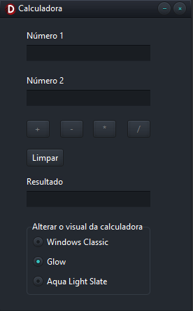

# Calculadora
Projeto de uma calculadora simples permitindo as operações de soma, subtração, multiplicação e divisão, incluindo regras como não possibilidade de divisão por 0 e a verificação de números nos campos para validar as operações. Este projeto foi realizado em Delphi 12 na plataforma disponibilizada pela Embarcadero Studios. 

